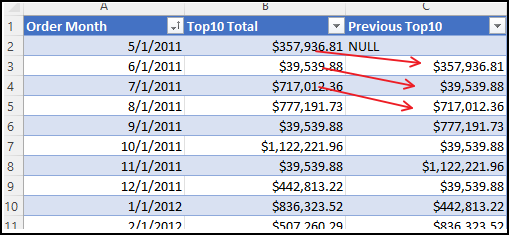

# Thoughts On the CTE Exercise

<!-- TOC -->

- [Thoughts On the CTE Exercise](#thoughts-on-the-cte-exercise)
  - [Introduction](#introduction)
  - [Sources and References](#sources-and-references)
  - [Problem to Solve](#problem-to-solve)
  - [Solution](#solution)
    - [The Subquery Approach](#the-subquery-approach)
    - [The Common Table Expression (CTE) Approach](#the-common-table-expression-cte-approach)

<!-- /TOC -->

---

## Introduction

My general thoughts had to be laid out here because I recognize the power of using common table expressions (CTEs) but initially felt very confused learning them. I was so confused that I thought I must have missed something much earlier, so I started the course from scratch. This was of course very frustrating. Eventually, I penned my thoughts in this markdown file.

---

## Sources and References

The original video presenting this challenge and the complete description is provided by Travis Cuzick.

[The Advanced SQL Server Masterclass For Data Analysis](https://www.udemy.com/course/advanced-sql-server-masterclass-for-data-analysis/) by Travis Cuzick on Udemy.

[MSDN documentation](https://docs.microsoft.com/en-us/sql/t-sql/queries/with-common-table-expression-transact-sql?view=sql-server-ver15) on using WITH in a CTE.

[Back to Top](#thoughts-on-the-cte-exercise)

---

## Problem to Solve

1. Identify the top 10 sales orders per month
2. Aggregate these into a sum total, by month
3. Compare each month's total to the previous month's on the same row

Upon seeing the problem, my first thought was just to solve it with a LAG function, however, the point was to learn how to write CTEs so I continued watching the demonstration.

[Back to Top](#thoughts-on-the-cte-exercise)

---

## Solution

Travis gave two solutions so that by example, we would know why it is better to use a CTE than to nest subqueries.

### The Subquery Approach

My code for this approach is modified from the code in the course: [Subquery-Approach](../Videos/29-CTEs_Part_1_of_2-Using_Subquery_Approach.sql)

The subquery approach takes the same query twice and joins them both, but the 2nd query uses a DATEFROMPARTS function to get the previous month's total due sum. It was helpful for me to open the query results in Excel which allowed me to look at the table more clearly, sort, filter, etc. In Travis' demo query, it doesn't sort by month, which was helpful to see in Excel. I changed the data type to currency there and you'll see the result below.

As you can see by the arrows I added to the image, each row in the "Previous Top10" column is showing the previous total from the month before.

After seeing this, I knew my earlier hunch was correct in that I could solve this problem by using a LAG function pretty quickly. But, for the sake of learning, I continued and agreed with the general idea that using subqueries, in this case, became difficult to understand. I think that was the point here; subqueries can be difficult to understand. Imagine taking on a project where someone used a bunch of subqueries. Take a look at just this one below:

Both nested inner queries above are _**exactly**_ the same. All we're doing is adding a derived column for the Order Month and top10 'TotalDue' values, then adding another column called 'Previous Top10' so we can compare. The final result should be sorted by date, and the previous column should come before the current Top10 column to make more sense visually.

[Back to Top](#thoughts-on-the-cte-exercise)

---

### The Common Table Expression (CTE) Approach

My code for this approach is modified from the code in the course: [CTE-Approach](../Videos/29-CTEs_Part_2_of_2-Using_Common_Data_Expression.sql)

In the next video, Travis demonstrates the CTE approach which starts with using a "WITH" clause followed by the alias of the first query.

*Note that a habit I developed while at NSH when I joined databases, I would declare my starting database at the top by saying "USE \[databsename\]" so I thought that was less confusing, and it worked for me. But it's a slightly bad habit if you don't put a semicolon after that statement. It will throw an error so either don't do it at all, or remember to put a semicolon after the db name.*

Essentially this runs our first query and gives it an alias as "Step1" and this is essentially a virtual table. Microsoft says this ["specifies a temporary named result set"](https://docs.microsoft.com/en-us/sql/t-sql/queries/with-common-table-expression-transact-sql?view=sql-server-ver15) which we see as a table result. Note that I'm using SQL for VS Code and a formatting extension so that's why it doesn't look like what you would see in SSMS.

The benefit of first writing subqueries begins to make sense when we go to the next step which is to grab the code from the next outermost query in the subqueries we wrote. Which means we pull both the previous query and the query surrounding it. In Step2 of the CTE process, we just reference the first result set by the alias name. This is much easier to read and less redundant than nesting a duplicate subquery.

The last step is changing the result part of the query so that we get the derived columns we need.

Which results in this table:

Notice that I didn't even have to write a reference to Step1 in the last step because it was already referenced in Step2. The final step is just joining those results to another derived column to show the month of the order. I also rearranged the previous Top10 to be before the current Top10 values, which made more sense to me.

[Back to Top](#thoughts-on-the-cte-exercise)
